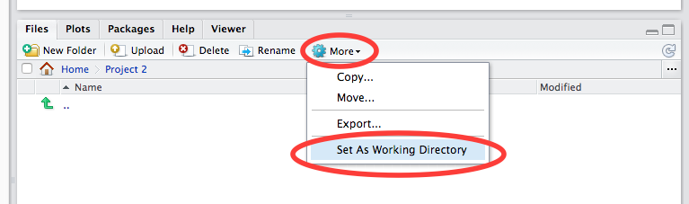
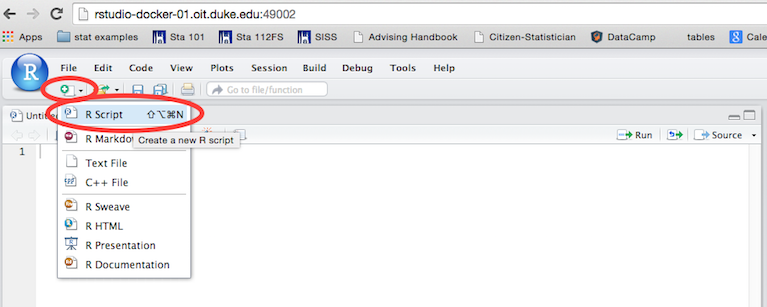

You and your teammates work for Paramount Pictures.

Your boss has just acquired data about audience movie scores along with
a variety of explanatory variables.

She is interested in learning what attributes make a movie popular and in
predicting future audience scores.  She is also interested in learning something
new about movies.

She wants your team to figure it all out.  The data can be loaded directly in RStudio using the following command:
```{r, eval=FALSE}
download("https://stat.duke.edu/~mc301/data/movies.Rdata", destfile="movies.Rdata")
load("movies.Rdata")
```

## Tasks

1. **EDA:** Do some exploratory data analysis to tell an "interesting" story about
   movies. Instead of limiting yourself to relationships between just two
   variables, broaden the scope of your analysis and employ creative approaches
   that evaluate relationships between two variables while controlling for
   another.
   
2. **Inference:** Come up with a research question that can be answered with a hypothesis test or a confidence interval, e.g. "Is there a difference in mean audience scores between genres?" or "What is the average difference in audience scores between movies that do and do not feature without oscar winner actors?" This question could be used to shed some light on your choice of the "best" linear model.  Carry out the appropriate inference task to answer your question.

3. **Modeling:** Develop the "best" multiple linear regression model to explain audience movie
   scores.

4. **Prediction:** Pick a movie from 2015 (a new movie that is not in the sample) and predict the audience score of that movie	using the `predict` function in R. Also quantify the uncertainty around this prediction.

## Data

The data set is comprised of 443 movies randomly sampled between 1974
and 2014.

- *Response*: audience scores (average audience scores on a 0-100 scale).

- *Explanatory*: there are several explanatory variables, such as `genre`,
  `mpaa_rating`, `critics_score`, etc. Details are given below.

## Getting started

* Create a new folder called "Project 2" in your Files tab, once created click on this folder, and then Click on More -> Set As Working Directory. This will ensure that your work for Project 2 is saved in a separate folder from your other course work.



* Open a new R Script, save it as your "teamname.R" (one word, no spaces, underscores OK), and save all your code here.



## Deliverables

1. **Poster** (due at the start of your final lab):

    Your poster should be organized like a paper. The following parts should be
    included and clearly labeled:

    * *Introduction*: a summary of the data set and your goal.

    * *EDA*: any univariate or bivariate summaries worth reporting.
    
    * *Inference*: Answer the research question you have posed using a hypothesis
        test or a confidence interval.  This can be like a condensed version of your first project.

    * *The "Best" Model*:

        * What is the "best" linear model for predicting the response variable? You
          do not need to explain every step you took to arrive at this model, but
          should give some indication of why you chose the model you did. If you
          tried a few different models, how did you settle on one?

       	* How well does your model do?  What is the percent variation explained?
	
	    * What does your model tell you about relationships between your
          explanatory variables and your response variable?
	  
        * What conditions do you need for your analysis to hold?  What are the
          implications if some of those conditions are violated.
	  
    * *Prediction*:

        * Using your best model and a movie from 2014 of your choosing, predict its
          audience score. (You will need to find the relevant information about the
          movie online.)
	  
        * Include a description of the uncertainty of you prediction.

    * *Conclusion*: 
        * What is the bottom line from your analysis? 
        * How well can your predict audience scores?
        * What are the caveats to your analysis?
        * Does this data set lack information that you would like to use?
	
- **Presentation** (due at the start of your final lab):

    * You will present your team's results during the last lab session of the
      semester. Each team will have 4 minutes scheduled during which all team
      members should be at the poster to give a formal presentation. Your poster
      should be used as a guide for your presentation, but you probably will not
      be able to go through all of the details on your poster in four minutes.
	  
    * The presentation should highlight what you think are your most interesting
      findings, or something that you believe may be unique about your
      approach. **All team members must contribute to this presentation.**
	  
- **Assessment** of other teams (due at the end of the lab section):

	For the rest of the poster session, you will be wandering around, **assessing**
    the other teams’ posters and asking questions. The lab time will be broken up
    so each person will spend 1/(# of members in team) of the remaining time by
    your own poster to answer questions. This is part of your grade, so every team
    member should feel comfortable answering questions regarding all aspects of
    the project.

- **Prediction competition** (due at the start of your final lab):

	* To compare each teams' models, there will be an "out-of-sample"
	competition. This means that I will use your model to predict audience
	scores for a new set of movies.
  	
	* The team with the smallest out-of-sample prediction error will win a prize.

	* See the section titled "Submitting Code" below on instructions for submitting your code.

## Tips for your poster and presentation

This project is an opportunity to apply what you have learned about descriptive
statistics, graphical methods, correlation and regression, and hypothesis
testing and confidence intervals.

The goal is not to do an exhaustive data analysis i.e., do not calculate every
statistic and procedure you have learned for every variable, but rather to show
that you are proficient at using R at a basic level and that you are proficient
at interpreting and presenting the results.

You might consider critiquing your own method, such as issues pertaining to the
reliability of the data and the appropriateness of the statistical analysis you
used within the context of this specific data set.

## Grading

Grading of the project will take into account:

- Correctness: Are the procedures and explanations correct?
- Presentation: What was the quality of the presentation and poster?
- Content/Critical thought: Did your think carefully about the problem?

Your grade will be roughly based on the following components:

- 40% poster
- 20% presentation
- 20% code
- 10% classmates' grades 
- 10% team peer evaluations

Team peer evaluation: You will be asked to fill out a survey where you rate the contribution of each team member.  Filling our the survey is a prerequisite for getting credit on the team member evaluation. For grades less than 5, please provide some explanation. If any individual gets an average peer grade less than 2.5, this person will receive half the grade of the rest of the group.

## Honor code

You may not discuss this project in any way with anyone outside your
team, besides the professor and TAs. Failure to abide by this policy
will result in a 0 for all teams involved.

And besides, you want to win the competition, right?

## Submitting code

Each team needs to submit code that can successfully be pasted into the
following R code block.  I should be able to run the code you submit and then
print the summary of the multiple linear regression using the variable named
`mlr`.

```{r, eval=FALSE}
load("movies.RData")

# BEGIN YOUR CODE

# ... if you do anything prior to running the regression ...

mlr = lm(..., data=movies)

# END YOUR CODE

summary(mlr)
```

To submit your team's code, create an R Script called "teamname.R" where
"teamname" is replaced with your team's name.

If you are using in RStudio in the cloud, follow the instructions
[here](https://stat.duke.edu/courses/Spring15/sta101.001/faq/#r5) to download the
"teamname.R" file to your computer.

Upload that file to Sakai under the assignment "Project 2".

Your code must run with no errors on my computer with only the data file as the input. This means you must make sure any variables you define, and model you fit, etc. are all included in the code. Instructions for checking the reproducibility of your code are given below.

Your final model **MUST** be called `mlr`, as the output of this model is what will be used for the prediction competition.

Note the variables that you are not allowed to use for prediction at the bottom of this document.

### Checking that your analysis is fully reproducible with the code you submit

You can make sure that this script is working properly by doing the following.

1. First, save your workspace by running the following command **in the
   console**.

```{r, eval=FALSE}
save.image("prj2_workspace.RData")
```

(Alternatively, you can go to Session -> Save Workspace As... and then give it a name, e.g. *prj2_workspace*.)

2. Then clear your workspace. **Attention:** The following command will delete every variable in your workspace, which is why it is important to do Step 1 first.

```{r, eval=FALSE}
rm(list=ls())
```

(Alternatively you can click on the Clear button in your environment -- the one with the broom icon.)

3. Load the dataset, run all of the code in your R script, and finally print out a summary of your model.

```{r, eval=FALSE}
load("movies.RData")
source("teamname.R")
summary(mlr)
```

If you get an error, go through the script "teamname.R" line by line (executing
each line one at a time) to see where the error occurs. Note that one potential source of error might be that you named your final model something other than `mlr`.

3. To restore your workspace, do
```{r, eval=FALSE}
load("prj2_workspace.RData")
```

(Alternatively, you can go to Session -> Load Workspace... and choose the workspace you want to load, e.g. *prj2_workspace*.)

This is the code I will be using to make sure you have submitted working code.
Note that the file "movies.RData" needs to be in the same folder as "teamname.R" for the
code above to work.

## Data details

The data frame has 25 attributes, which may be broken into three categories.

**Title and response variable**:

- `title`: Title of movie
- `audience_score`: Audience score on Rotten Tomatoes (response variable)

**Explanatory variables you may use in the model.**

- `type`: Type of movie (Documentary, Feature Film, TV Movie)
- `genre`: Genre of movie (Action & Adventure, Comedy, Documentary, Drama, Horror, Mystery & Suspense, Other)
- `runtime`: Runtime of movie (in minutes)
- `year`: Year the movie is released
- `mpaa_rating`: MPAA rating of the movie (G, PG, PG-13, R, Unrated)
- `imdb_num_votes`: Number of votes on IMDB
- `critics_score`: Critics score on Rotten Tomatoes
- `critics_rating`: Categorical variable for critics rating on Rotten Tomatoes (Certified Fresh, Fresh, Rotten)
- `best_pic_nom`: Whether or not the movie was nominated for a best picture Oscar (no, yes)
- `best_pic_win`: Whether or not the movie won a best picture Oscar (no, yes)
- `best_actor_win`: Whether or not one of the main actors in the movie ever won an Oscar (no, yes) -- note that this is not necessarily whether the actor won an Oscar for their role in the given movie
- `best_actress win`: Whether or not one of the main actresses in the movie ever won an Oscar (no, yes) -- not that this is not necessarily whether the actresses won an Oscar for their role in the given movie
- `best_dir_win`: Whether or not the director of the movie ever won an Oscar (no, yes) -- not that this is not necessarily whether the director won an Oscar for the given movie
- `top200_box`: Whether or not the movie is in the Top 200 Box Office list on BoxOfficeMojo (no, yes)

**The following variables are included as additional information, but should not be part of the model you develop.**
  
- `audience_rating`: Categorical variable for audience rating on Rotten Tomatoes (Spilled, Upright)
- `director`: Director of the movie
- `actor1-actor5`: List of first 5 main actors in the movie (abridged cast), this information was used to determine whether the movie casts an actor or actress who won a best actor or actress Oscar
- `rt_url`: Link to Rotten Tomatoes page for the movie
- `imdb_url`: Link to IMDB page for the movie
- `imdb_id`: IMDB ID of the movie
