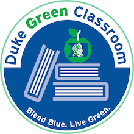

### Teaching team:

|---------------------+---------------------+---------------------+---------------------+---------------------+---------------------|
|Professor            | TAs                            |
|:--------------------|:--------------------|:-------------------:|:-------------------:|:-------------------:|:-------------------:|
|[Dr. Çetinkaya-Rundel](http://stat.duke.edu/~mc301) | TBA |  |  |  |
|---------------------+---------------------+---------------------+---------------------+---------------------+---------------------|

* * *

### Required materials:

* Textbook: [OpenIntro Statistics](http://www.openintro.org/stat/textbook.php?stat_book=os) - Diez, Barr, Çetinkaya-Rundel \\
   CreateSpace, 2nd Edition, 2012 (ISBN: 1478217200) \\
The textbook is freely [available online](http://www.openintro.org/stat/textbook.php). You're welcomed to read on screen or print it out. If you prefer a paperback version you can buy it at the cost of printing (under $10) [on Amazon](http://www.amazon.com/dp/1478217200). The textbook store will not carry copies of this text.

* Clicker: [i>clicker2](http://www.amazon.com/I-Clicker-2-I-Clicker/dp/1429280476) (ISBN: 1429280476) \\
If you would like to purchase a used clicker from a former student, see the list of students selling their clickers [at this Google Doc](https://docs.google.com/spreadsheet/ccc?key=0AkY2lFgS9uiDdE1fMkZUZnp6alJDSG9tYlIwTFJWdnc#gid=0). You can contact them directly, or leave your name on the list under "Wants to buy clicker". The clickers will also be available at the Duke textbook store, or you can get them for slightly cheaper [on Amazon](http://www.amazon.com/I-Clicker-2-I-Clicker/dp/1429280476). Note that this is i>clicker2, and not i>clicker+.

* Calculator (optional): You will be allowed to use a calculator in this class. There is no restrictions on the type of calculator. A simple calculator that can take square roots should be sufficient.

* * *

### Class meetings:
* Lectures: Mondays and Wednesdays, 1:25 pm - 2:40 pm, Bio Sci 111 
* Labs: Tuesdays, Old Chem 101
    * 10:05 am - 11:20 am - TA: TBD
    * 11:45 am - 1:00 pm - TA: TBD
    * 1:25 pm - 2:40 pm - TA: TBD
    * 3:05 pm - 4:20 pm - TA: TBD
    * 4:40 pm - 5:55 pm - TA: TBD

* * *

### Exams:

* Midterm 1: Wednesday, Feb 18, in class
* Midterm 2: Wednesday, Mar 25, in class
* Final: Saturday, May 2, 2-5 pm

* * *

### Office Hours:
* Professor Cetinkaya-Rundel -  Old Chemistry 213 or by appointment.
    * Mondays - 11am-1pm
    * Wednesdays - 12:30-2:30pm
* Teaching Assistants - Old Chemistry 211A
    * Mao - Mondays 7-9pm
    * Michael - Wednesday 5-7pm
    * Andrew - Monday 6-9pm + Thursday 3-6pm
    * Anthony - Monday 4-6pm
* [SECC](https://stat.duke.edu/courses/sec-schedule) - Sunday to Thursday, 4:00 pm - 9:00 pm, Old Chemistry 211A. You should be able to seek help from any TA, but you might want to start with our TAs or the TAs for the other Sta 101 section (both sections cover the same material roughly around the same time).

* * *

### Grade breakdown:

<table style="width:400px;">
<tr> <td> Attendance & participation + peer evaluation </td> <td> 7.5% </td></tr>
<tr> <td> Problem sets              </td> <td> 10% </td></tr>
<tr> <td> Labs                      </td> <td> 10% </td></tr>
<tr> <td> Readiness assessments     </td> <td> 10% </td></tr>
<tr> <td> Performance assessments   </td> <td> 2.5% </td></tr>
<tr> <td> Project 1        </td> <td>  5% </td></tr>
<tr> <td> Project 2        </td> <td> 10% </td></tr>
<tr> <td> Midterm 1        </td> <td> 10% </td></tr>
<tr> <td> Midterm 2        </td> <td> 10% </td></tr>
<tr> <td> Final            </td> <td> 25% </td></tr>
</table>

* * *

### Holidays:

* Mon, Jan 19 - Martin Luther King, Jr. Day
* Mon, Mar 9 + Tue, Mar 10 + Wed, Mar 11 - Spring Break

* * *

### Green Classroom

{:.right}

This course has achieved Duke’s Green Classroom Certification. The certification indicates that the faculty member teaching this course has taken significant steps to green the delivery of this course. Your faculty member has completed a checklist indicating their common practices in areas of this course that have an environmental impact, such as paper and energy consumption. Some common practices implemented by faculty to reduce the environmental impact of their course include allowing electronic submission of assignments, providing online readings and turning off lights and electronics in the classroom when they are not in use. The eco-friendly aspects of course delivery may vary by faculty, by course and throughout the semester. Learn more at [http://sustainability.duke.edu/action/certifications/classroom/index.php](http://sustainability.duke.edu/action/certifications/classroom/index.php).
